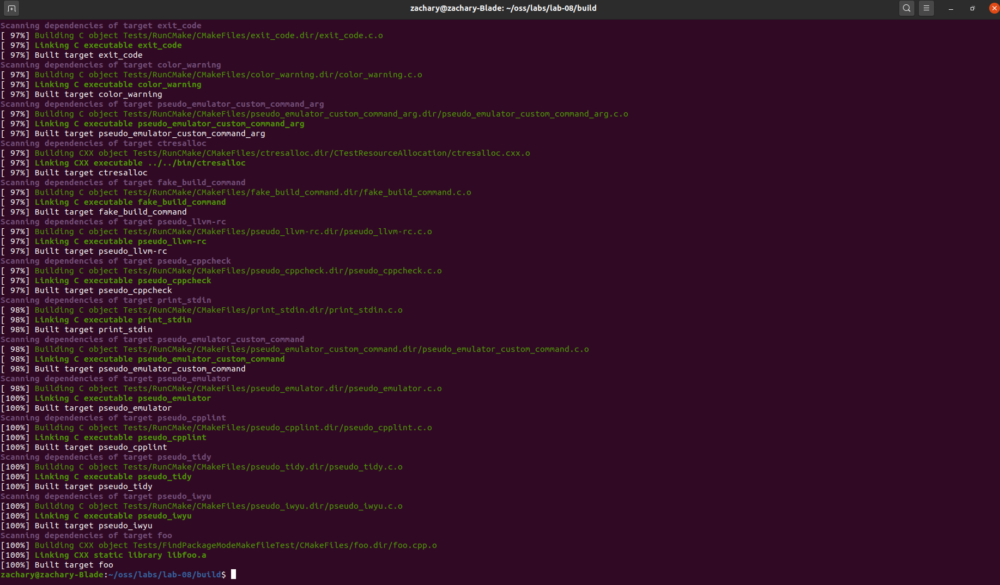

# Lab 8: Testing and Continuous Integration

**Checkpoint 1**  
  

**Checkpoint 2**  
We can determine what tests are run for a particular submission  
by clicking a Build Name and scrolling to the Configure Output  
where a log with all tests run is displayed.  

Navigating to a build with failures on CDash, we can use this  
Configure Output log to find out what tests failed, giving us  
logical clues as to whats wrong with the code and how to debug.  

Navigating to builds close to my specific configuration, there  
are certainly at least a warning or a failure on the dashboard.  
These errors and warnings seem to relate to non-zero return values  
and a failed copyright test (copyright expires in 2020 but its 2021).
The main concern is the copyright failure.  

Experimental Dashboard:  
<insert here>
